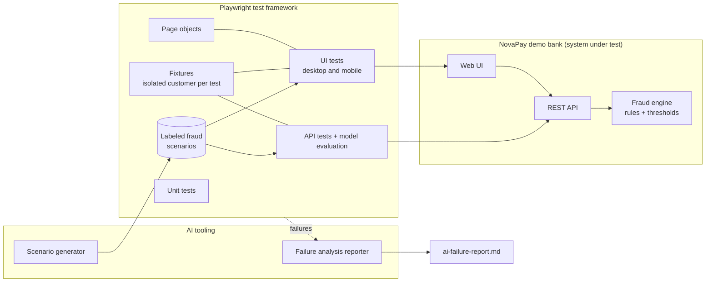

# AI-assisted Playwright framework for fintech fraud testing

[](https://github.com/steffx/ai_framework/actions/workflows/tests.yml)


End-to-end test automation for **NovaPay**, a small fictional online bank with a rule-based
**fraud detection engine**. The repository contains both the system under test and the test
framework, so everything runs locally with one command.

The framework covers what a QA engineer in a bank actually has to test: payments, fraud
decisions, step-up verification (one-time codes), card controls, sensitive-data handling and
accessibility. It also uses **AI** to generate fraud test data and to triage failing tests.

> NovaPay is fictional. All names, accounts and IBANs are generated test data.

## Highlights

- **~200 automated tests** across four Playwright projects: unit, API, desktop UI and mobile UI
- **Page Object Model** with custom fixtures: every test gets its own freshly created customer, so tests run in parallel without sharing state
- **Fast, reliable setup**: preconditions are created through the API and only the behaviour under test goes through the browser
- **Data-driven fraud testing**: one labeled scenario file drives UI journeys, API regression and model evaluation
- **Fraud model evaluation**: precision, recall and false block rate checked against a quality bar in CI
- **AI features**: LLM-generated fraud scenarios and an AI failure-analysis reporter, both with offline fallbacks
- **Finance-specific checks**: masked IBANs and card numbers, no data leaks in CSV exports, IDOR and OTP replay protection, cent-exact money handling, account lockout, secure session cookies
- **Accessibility**: axe-core WCAG 2.1 AA scans on every page (European Accessibility Act)
- **CI** on GitHub Actions: parallel jobs, HTML reports, JUnit output, metrics and AI analysis in the run summary

## Architecture



## The system under test

| Feature | What it does |
| --- | --- |
| Login | Username and password, account locked after 3 failed attempts, HttpOnly session cookie |
| Dashboard | Checking and savings balances, masked IBANs and card number, recent activity, fraud alert banner |
| Send money | IBAN checksum validation, 3-step flow (details, review, result), transfer limit, insufficient funds |
| Fraud engine | Scores every transfer 0-100 and decides **approve**, **review** (one-time code) or **block** |
| Transactions | Filter, search, sort, details dialog with risk score and signals, CSV export |
| Card & security | Freeze or unfreeze the card, review security alerts, report fraud (freezes the card) |

### Fraud rules

| Rule | Points | Fires when |
| --- | ---: | --- |
| `VERY_LARGE_AMOUNT` | 50 | amount ≥ €10,000 |
| `LARGE_AMOUNT` | 25 | €3,000 ≤ amount < €10,000 |
| `HIGH_RISK_COUNTRY` | 40 | recipient bank in IR, KP, MM, SY, YE or AF |
| `NEW_PAYEE` | 15 | first payment to this IBAN |
| `HIGH_VELOCITY` | 30 | 3 or more transfers in the last 10 minutes |
| `DRAINS_BALANCE` | 20 | amount ≥ 90% of the balance |
| `SUSPICIOUS_DESCRIPTION` | 20 | reference mentions gift cards, crypto, "urgent", lottery… |

Score **≥ 70 blocks** the payment, **40-69 requires a one-time code**, below 40 is approved.

## Test suite

| Project | Tests | Covers |
| --- | ---: | --- |
| `unit` | 26 | IBAN checksum, evaluation metrics, data redaction, money parsing, scenario validation |
| `api` | 74 | Fraud API auth, validation, contract, each rule in isolation, boundary values, labeled regression, transfers, OTP, IDOR, data isolation, model evaluation |
| `desktop-chromium` | 85 | Every UI journey (below) |
| `mobile-chromium` | 13 | Critical journeys tagged `@mobile` on a Pixel 7 viewport |

UI suites in `tests/ui/`:

| File | Tests | Examples |
| --- | ---: | --- |
| `auth.spec.js` | 12 | login, field validation, attempts counter, lockout, no user enumeration, logout, protected routes, cookie flags |
| `dashboard.spec.js` | 9 | formatted balances, masked data, recent activity, navigation, mobile menu, fraud banner |
| `transfer.spec.js` | 21 | happy paths, 9 data-driven validation cases, IBAN formatting, review/edit, limits, frozen card, double-submit guard, server error handling |
| `fraud-decisions.spec.js` | 11 | labeled scenarios replayed through the UI, blocked payment explanation, known payees |
| `step-up-verification.spec.js` | 8 | correct code, wrong code attempts, cancellation after 3 wrong codes, malformed codes, velocity rule |
| `transactions.spec.js` | 10 | filters, search, empty state, sorting, details dialog, keyboard access, CSV export content |
| `card-security.spec.js` | 8 | freeze and unfreeze, persistence, alerts, "this was me", report fraud, cancel dialog |
| `accessibility.spec.js` | 6 | axe-core scans of every page, including error states |

Tags let you run slices: `@smoke`, `@mobile`, `@fraud`, `@a11y`, `@eval`.

### Model evaluation vs. regression

`test-data/fraud-scenarios.json` contains 30 payments, each with a **ground-truth label**
(fraud or legit) and the **decision the rules should make**. They are used in two different ways:

- **Regression** (`fraud-score.spec.js`): the engine must return exactly the expected decision. Catches unintended rule changes.
- **Evaluation** (`fraud-model-eval.spec.js`): compares decisions with the true labels and computes quality metrics. The current engine deliberately misses two small scams, so this shows the difference between "the code does what it was built to do" and "the model is good enough".

| Metric | Quality bar | Current |
| --- | --- | --- |
| Precision | ≥ 0.75 | 0.81 |
| Recall | ≥ 0.85 | 0.87 |
| False block rate (genuine payments hard-blocked) | 0 | 0 |

## AI features

Both tools use Anthropic (`ANTHROPIC_API_KEY`) or OpenAI (`OPENAI_API_KEY`) when a key is set,
and fall back to deterministic behaviour otherwise, so tests and CI never depend on a paid API.

**Scenario generator** (`npm run ai:generate`): asks an LLM for realistic fraud and legitimate payments
across known fraud typologies (safe-account, romance, investment and invoice-redirection scams, account
takeover, money mules). Every scenario is schema-validated before it is saved. Generated data is
evaluated **report-only**: it is never allowed to fail the build until a human has reviewed it and moved
it into the curated dataset.

**Failure analysis reporter** (`ai/failure-analyzer-reporter.js`): a custom Playwright reporter. For
each failed test it collects the error, the test source around the failure and the page snapshot, and
writes `ai-failure-report.md` with a verdict (product bug, test bug or environment) and a suggested fix.
In CI the report is added to the run summary.

**Customer data never reaches the AI**: IBANs, card numbers, passwords, session tokens and API keys are
redacted first (`src/utils/redact.js`, covered by unit tests).

## Getting started

Requirements: Node.js 20 or newer.

```bash
npm install
npx playwright install chromium

npm test                 # everything (starts the app automatically)
npm run test:smoke       # critical paths only
npm run test:ui          # desktop + mobile UI
npm run test:api         # API tests and model evaluation
npm run test:headed      # watch the browser
npm run report           # open the HTML report
```

To explore the app by hand, run `npm start` and open http://localhost:3000 (user `demo`, password `Demo123!`).

Optional AI:

```bash
export ANTHROPIC_API_KEY=...   # or OPENAI_API_KEY
npm run ai:generate -- --count 30
npx playwright test tests/api/fraud-model-eval.spec.js
```

## Project structure

```
app/                     NovaPay demo bank (Express + vanilla JS)
  fraud/engine.js        fraud rules and thresholds
ai/
  llm.js                 minimal Anthropic / OpenAI client
  generate-scenarios.js  AI test data generator
  failure-analyzer-reporter.js
src/
  pages/                 page objects (+ shared header component)
  fixtures/test.js       custom fixtures
  api/BankApi.js         API client for test setup
  data/ibans.js          valid / invalid IBAN builders
  eval/metrics.js        precision, recall, false block rate
  utils/                 money parsing, redaction, API contracts
tests/
  unit/  api/  ui/
test-data/fraud-scenarios.json
.github/workflows/tests.yml
```

## Design decisions

- **One customer per test.** A fixture creates a new customer through a test-only API endpoint. No shared accounts means no order dependencies and safe parallel runs.
- **Set up through the API, verify through the UI.** Logging in, seeding payments or freezing a card through the browser is slow and not what most tests are about. The `customerApi` fixture shares the browser's session cookie, so API setup and UI checks act as the same customer.
- **Accessible locators first.** Page objects use `getByRole` and `getByLabel` wherever possible, so tests also fail when the UI stops being accessible. `data-testid` is used only for non-semantic elements.
- **Test hooks are explicit.** The one-time code is read from a test endpoint that simulates the SMS inbox and can be switched off with `ENABLE_TEST_API=false`.
- **Tests found a real bug.** Opening transaction details with the Enter key closed the dialog immediately, because the same key press activated its Close button. The keyboard accessibility test caught it (see the commit history).

## Possible next steps

- Visual regression snapshots for the key screens
- Publish the HTML report to GitHub Pages
- Contract tests with a JSON Schema validator
- Machine learning model alongside the rules, compared with the same evaluation
